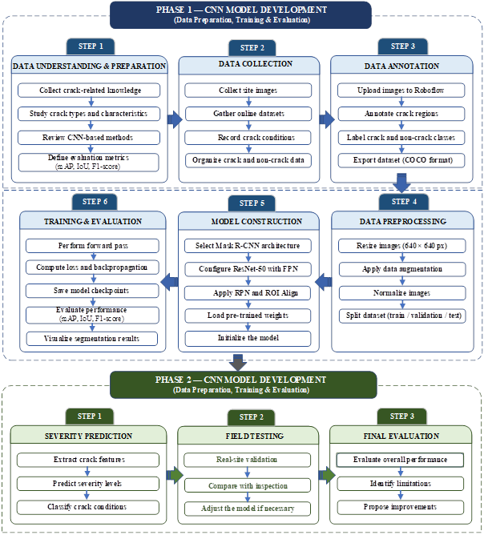

<p align="center">
  
</p>

<h1 align="center">BKAI – Mask R-CNN + ResNet50</h1>

<p align="center">
  <b>Concrete Crack Detection & Instance Segmentation</b><br>
  Mask R-CNN | ResNet-50 | FPN | Detectron2
</p>

<p align="center">
  
  
  
  
</p>

---

## 🔥 Overview

BKAI is a deep learning framework designed for **automatic concrete crack detection and instance segmentation** in civil infrastructure.

The model enables:

- 🎯 Pixel-level crack segmentation  
- 🔍 Instance-level crack separation  
- 📏 Crack morphology analysis  
- ⚡ High accuracy in real-world conditions  

---

## 🧠 Computer Vision Tasks

<p align="center">
  
</p>

---

## 🧬 Model Evolution

<p align="center">
  
</p>

---

## 🏗️ Mask R-CNN Architecture

<p align="center">
  
</p>

---

## 🔍 Feature Pyramid Network

<p align="center">
  
</p>

---

## ⚙️ ROI Align

<p align="center">
  
</p>

---

## 🧱 Backbone (ResNet-50)

<p align="center">
  
</p>

---

## 📊 Dataset Analysis

<p align="center">
  
</p>

- 24,000 training images  
- 1,000 validation images  
- Multi-scale crack distribution  
- Real-world + augmented data  

---

## 📉 Training Process

<p align="center">
  
</p>

<p align="center">
  
</p>

---

## 📈 Evaluation

<p align="center">
  
</p>

<p align="center">
  
</p>

<p align="center">
  
</p>

<p align="center">
  
</p>

---

## 🖼️ Prediction Results

<p align="center">
  
</p>

✔ Instance segmentation  
✔ Bounding box + mask  
✔ Confidence score  

---

## 🔥 Highlights

- Mask R-CNN (Instance Segmentation)
- ResNet-50 + FPN backbone
- COCO evaluation metrics (mAP, AP50, AP75)
- High precision (~99% F1-score)
- Optimized for thin crack detection
- Deployable via Streamlit

---

## ⚙️ Installation

```bash
git clone https://github.com/bkai-ndt-sdh231/BKAI-Model-Mask-R-CNN.git
cd BKAI-Model-Mask-R-CNN
pip install -r requirements.txt
