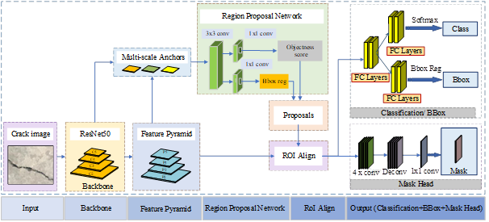
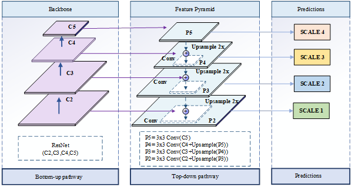
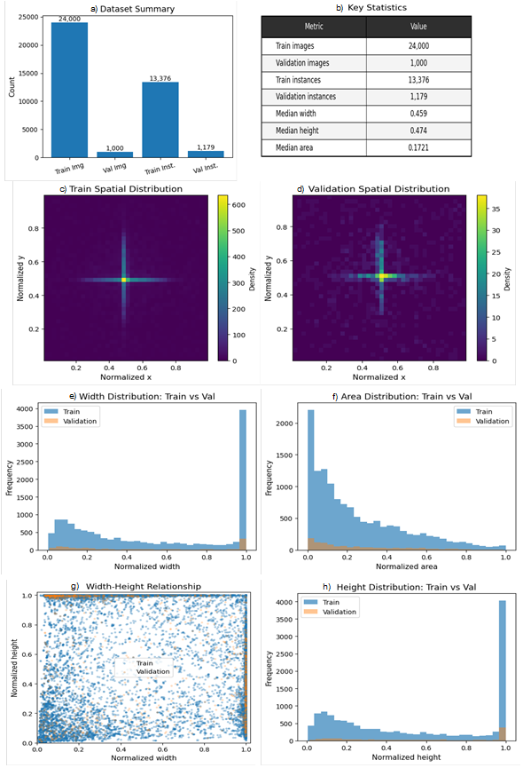
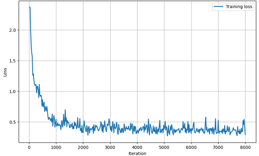
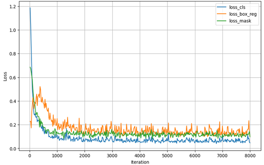
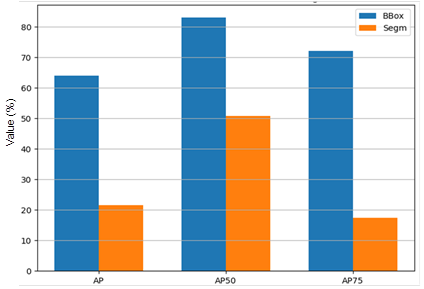
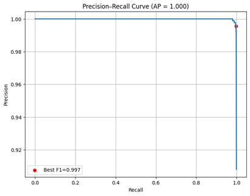

<h1 align="center">Deep Learning–Based Concrete Crack Detection using Mask R-CNN</h1>

<p align="center">
  <b>Instance Segmentation Framework for Structural Health Monitoring</b><br>
  Mask R-CNN | ResNet-50 | Feature Pyramid Network | Detectron2
</p>

---

## 1. Abstract

The detection and assessment of concrete cracks play a critical role in structural health monitoring and infrastructure maintenance. Conventional inspection methods are often labor-intensive, time-consuming, and prone to subjective errors under complex field conditions.  

This study presents an automated crack detection and instance segmentation framework based on the Mask R-CNN architecture with a ResNet-50 backbone and Feature Pyramid Network (FPN). The proposed approach enables precise pixel-level segmentation and accurate identification of thin and irregular crack patterns.  

A large-scale dataset was constructed from real-world infrastructure images combined with publicly available data. The dataset was annotated following the COCO standard and enhanced using data augmentation techniques to improve generalization capability.  

Experimental results demonstrate strong performance in both detection and segmentation tasks, with high precision, recall, and F1-score. The model is further deployed on a web-based platform (BKAI system) for real-time crack analysis and structural condition assessment. :contentReference[oaicite:0]{index=0}

---

## 2. Introduction

Concrete is one of the most widely used construction materials due to its high compressive strength and durability. However, structural degradation in the form of cracks is inevitable due to mechanical loading, environmental conditions, and material behavior.  

Crack propagation reduces structural integrity and accelerates deterioration processes such as reinforcement corrosion. Early detection is therefore essential to ensure safety, reduce maintenance costs, and extend service life. :contentReference[oaicite:1]{index=1}  

Traditional inspection methods rely heavily on manual observation, which is inefficient and unreliable in large-scale infrastructure systems. With the rapid development of artificial intelligence, deep learning–based approaches have emerged as promising solutions for automated structural inspection.  

Among these approaches, instance segmentation models such as Mask R-CNN provide superior capability in capturing fine crack morphology compared to conventional detection or classification models.

---

## 3. Methodology

The proposed framework is based on the Mask R-CNN architecture integrated with a ResNet-50 backbone and Feature Pyramid Network (FPN).  

The overall pipeline consists of:

- Feature extraction using ResNet-50  
- Multi-scale feature representation via FPN  
- Region Proposal Network (RPN)  
- ROI Align for precise spatial alignment  
- Multi-task prediction (classification, bounding box regression, mask segmentation)  

The integration of these components enables simultaneous object detection and pixel-level segmentation, allowing accurate characterization of complex crack patterns.

---

## 4. Dataset and Preprocessing

A comprehensive dataset was constructed by integrating:

- Real-world images from infrastructure sites  
- Public datasets (e.g., SDNET2018, DeepCrack)  
- Additional images from online sources  

The dataset includes:

- 24,000 training images  
- 1,000 validation images  
- Balanced crack and non-crack samples  

All images were annotated using polygon-based instance segmentation in COCO format and resized to 640×640 pixels. Data augmentation techniques such as flipping, rotation, brightness adjustment, and noise injection were applied to improve model robustness. :contentReference[oaicite:2]{index=2}  

---

## 5. Results and Performance

The model demonstrates strong convergence behavior and stable training performance.  

### Performance Metrics:

| Metric | Value |
|------|------|
| Precision | 98.37% |
| Recall | 99.89% |
| F1-score | 99.13% |
| AP50 | 82.89 |
| AP75 | 72.04 |
| mAP (0.5–0.95) | 63.99 |

The results indicate high reliability in crack detection and robust performance in challenging conditions involving thin and irregular crack patterns. :contentReference[oaicite:3]{index=3}  

---

## 6. Visual Analysis

<p align="center">
  
  
</p>

<p align="center">
  
  
</p>

<p align="center">
  
  
</p>

<p align="center">
  
</p>

---

## 7. Discussion

The proposed Mask R-CNN framework demonstrates superior performance compared to conventional detection and segmentation approaches.  

The integration of FPN significantly enhances multi-scale feature representation, enabling effective detection of small and thin cracks. Additionally, ROI Align improves spatial accuracy, resulting in precise segmentation boundaries.  

Despite higher computational cost compared to one-stage detectors, the model provides significantly improved segmentation quality, making it suitable for structural health monitoring applications.

---

## 8. Conclusion

This study presents a robust deep learning framework for automated crack detection and instance segmentation in concrete structures.  

The proposed method achieves high accuracy and strong generalization capability under real-world conditions. The integration of detection and segmentation enables detailed crack analysis, supporting practical applications in infrastructure inspection and maintenance.  

Future work will focus on improving real-time performance and expanding the system for multi-damage detection.

---

## 9. Implementation

```bash
git clone https://github.com/bkai-ndt-sdh231/BKAI-Model-Mask-R-CNN.git
cd BKAI-Model-Mask-R-CNN
pip install -r requirements.txt
