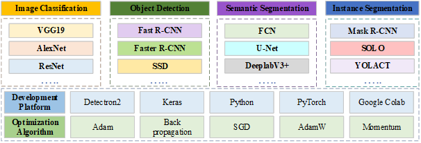
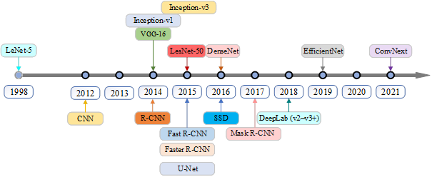
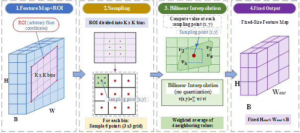
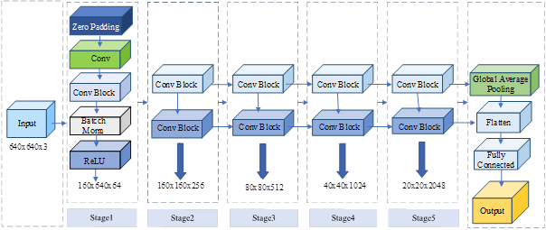
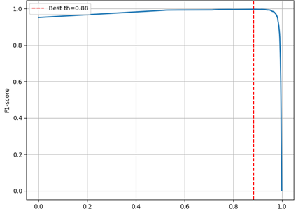

<h1 align="center">BKAI – Mask R-CNN + ResNet50</h1>

<p align="center">
  <b>Concrete Crack Detection & Instance Segmentation</b><br>
  Mask R-CNN | ResNet-50 | FPN | Detectron2
</p>

<p align="center">
  
  
  
  
</p>

---

## 🔥 Overview

BKAI is a deep learning framework for **automatic concrete crack detection and instance segmentation** in civil infrastructure.

Unlike conventional approaches, the model enables:

- 🎯 Pixel-level crack segmentation  
- 🔍 Instance-level crack separation  
- 📏 Crack morphology analysis  
- ⚡ Robust performance in real-world environments  

---

## 🧠 Methodology

The proposed system is built upon the **Mask R-CNN architecture with a ResNet-50 backbone and Feature Pyramid Network (FPN)**.

The pipeline consists of:

1. Feature extraction using ResNet-50  
2. Multi-scale feature representation via FPN  
3. Region Proposal Network (RPN)  
4. ROI Align for precise feature mapping  
5. Multi-task prediction (classification, bounding box, mask)  

---

## 📊 Dataset

- 24,000 training images  
- 1,000 validation images  
- Multi-source dataset (real + augmentation)  
- Thin, elongated crack distribution  

---

## 📈 Performance

| Metric        | Value |
|--------------|------|
| Precision    | 98.37% |
| Recall       | 99.89% |
| F1-score     | 99.13% |
| AP50         | 82.89 |
| AP75         | 72.04 |
| mAP (0.5–0.95) | 63.99 |

---

## 🖼️ Visual Results

<p align="center">
  
  
</p>

<p align="center">
  
  
</p>

<p align="center">
  
  
</p>

<p align="center">
  
  
</p>

<p align="center">
  
  
</p>

<p align="center">
  
  
</p>

<p align="center">
  
  
</p>

---

## 🔥 Highlights

- Instance segmentation (Mask R-CNN)  
- COCO evaluation metrics  
- High precision (~99% F1-score)  
- Optimized for thin crack detection  
- Real-world dataset  
- Deployable via Streamlit  

---

## ⚙️ Installation

```bash
git clone https://github.com/bkai-ndt-sdh231/BKAI-Model-Mask-R-CNN.git
cd BKAI-Model-Mask-R-CNN
pip install -r requirements.txt
